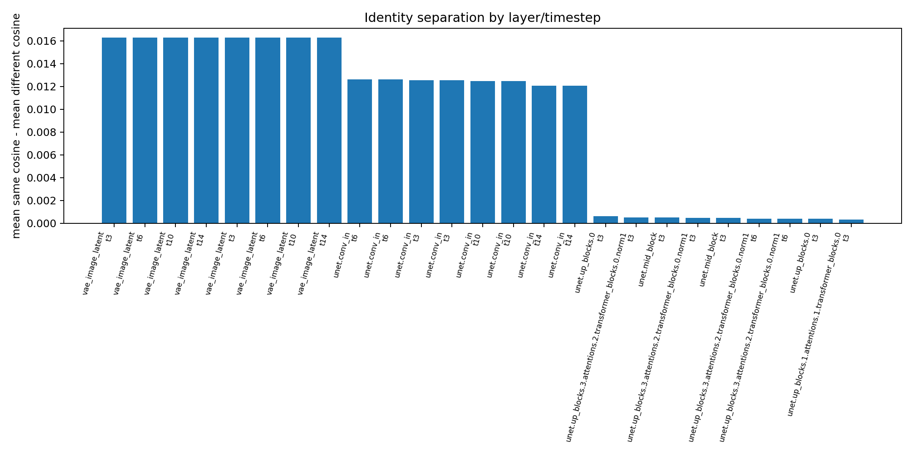
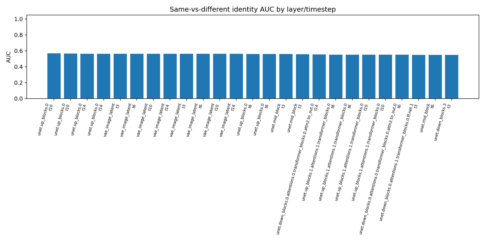
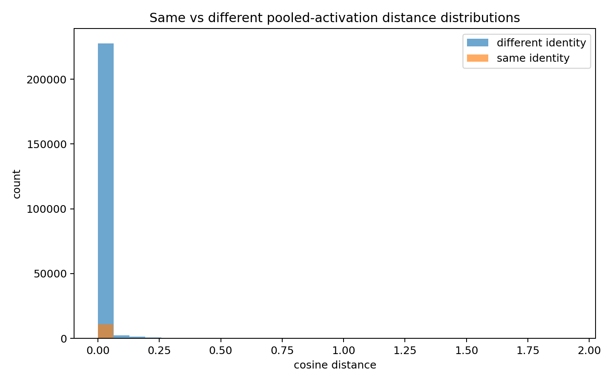
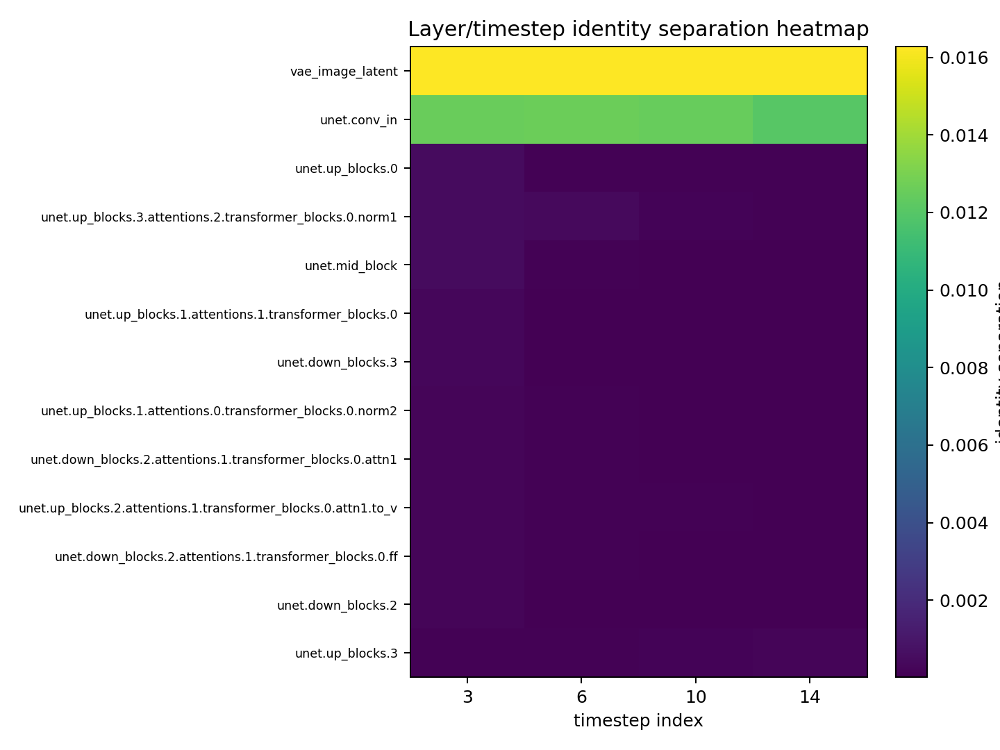

# InstructPix2Pix Identity Layer Scan

Milestone 1 scans frozen InstructPix2Pix internal activations for identity-separable layers. This is not a geometry attack and does not modify model weights.

## Run summary

- Model: `timbrooks/instruct-pix2pix`
- Inventory candidates: 415
- Recommended initial layers: 35
- Extracted embeddings: 11160
- Layer/prompt/timestep scores: 248
- Note: default MAT auto-manifest pairs are development diagnostics unless replaced with a richer identity dataset.

## Ranked layers

| rank | layer | rank score | mean separation | mean AUC | prompt instability | timestep instability |
|---:|---|---:|---:|---:|---:|---:|
| 1 | `vae_image_latent` | 0.5786 | 0.0163 | 0.5623 | 0.0000 | 0.0000 |
| 2 | `unet.conv_in` | 0.5598 | 0.0124 | 0.5476 | 0.0000 | 0.0002 |
| 3 | `unet.up_blocks.0` | 0.5578 | 0.0002 | 0.5578 | 0.0000 | 0.0002 |
| 4 | `unet.up_blocks.1.attentions.1.transformer_blocks.0` | 0.5501 | 0.0001 | 0.5501 | 0.0000 | 0.0001 |
| 5 | `unet.mid_block` | 0.5495 | 0.0002 | 0.5495 | 0.0000 | 0.0002 |
| 6 | `unet.down_blocks.0.attentions.1.transformer_blocks.0.ff.net.1` | 0.5483 | 0.0001 | 0.5483 | 0.0000 | 0.0000 |
| 7 | `unet.down_blocks.0.attentions.0.transformer_blocks.0.attn2.to_out.0` | 0.5474 | 0.0000 | 0.5474 | 0.0000 | 0.0000 |
| 8 | `unet.down_blocks.3` | 0.5441 | 0.0001 | 0.5441 | 0.0000 | 0.0001 |
| 9 | `unet.up_blocks.1.attentions.0.transformer_blocks.0.norm2` | 0.5441 | 0.0001 | 0.5441 | 0.0000 | 0.0001 |
| 10 | `unet.up_blocks.3.attentions.2.transformer_blocks.0.norm3` | 0.5438 | 0.0001 | 0.5438 | 0.0000 | 0.0001 |
| 11 | `unet.up_blocks.3` | 0.5430 | 0.0002 | 0.5429 | 0.0000 | 0.0000 |
| 12 | `unet.down_blocks.2` | 0.5425 | 0.0001 | 0.5425 | 0.0000 | 0.0001 |
| 13 | `unet.down_blocks.2.attentions.1.transformer_blocks.0.ff` | 0.5424 | 0.0001 | 0.5424 | 0.0000 | 0.0001 |
| 14 | `unet.down_blocks.1.attentions.1.transformer_blocks.0.ff.net.0` | 0.5419 | 0.0000 | 0.5419 | 0.0000 | 0.0000 |
| 15 | `unet.up_blocks.3.attentions.2.transformer_blocks.0.norm1` | 0.5419 | 0.0003 | 0.5417 | 0.0000 | 0.0002 |
| 16 | `unet.down_blocks.0` | 0.5410 | 0.0001 | 0.5410 | 0.0000 | 0.0000 |
| 17 | `unet.up_blocks.1.attentions.2.transformer_blocks.0.ff.net.2` | 0.5405 | 0.0000 | 0.5405 | 0.0000 | 0.0000 |
| 18 | `unet.up_blocks.1.attentions.2.transformer_blocks.0.attn1.to_out.0` | 0.5394 | 0.0000 | 0.5393 | 0.0000 | 0.0000 |
| 19 | `unet.down_blocks.2.attentions.1.transformer_blocks.0.attn1` | 0.5391 | 0.0001 | 0.5391 | 0.0000 | 0.0001 |
| 20 | `unet.up_blocks.1` | 0.5385 | 0.0001 | 0.5384 | 0.0000 | 0.0000 |

## Top identity-separable layer/timestep rows

| rank | layer | prompt | timestep | same distance | diff distance | separation | AUC |
|---:|---|---|---:|---:|---:|---:|---:|
| 1 | `vae_image_latent` | add black sunglasses | 3 | 0.2007 | 0.2170 | 0.0163 | 0.5623 |
| 2 | `vae_image_latent` | add black sunglasses | 6 | 0.2007 | 0.2170 | 0.0163 | 0.5623 |
| 3 | `vae_image_latent` | add black sunglasses | 10 | 0.2007 | 0.2170 | 0.0163 | 0.5623 |
| 4 | `vae_image_latent` | add black sunglasses | 14 | 0.2007 | 0.2170 | 0.0163 | 0.5623 |
| 5 | `vae_image_latent` | add headphones | 3 | 0.2007 | 0.2170 | 0.0163 | 0.5623 |
| 6 | `vae_image_latent` | add headphones | 6 | 0.2007 | 0.2170 | 0.0163 | 0.5623 |
| 7 | `vae_image_latent` | add headphones | 10 | 0.2007 | 0.2170 | 0.0163 | 0.5623 |
| 8 | `vae_image_latent` | add headphones | 14 | 0.2007 | 0.2170 | 0.0163 | 0.5623 |
| 9 | `unet.conv_in` | add black sunglasses | 6 | 0.1184 | 0.1310 | 0.0126 | 0.5479 |
| 10 | `unet.conv_in` | add headphones | 6 | 0.1184 | 0.1310 | 0.0126 | 0.5479 |
| 11 | `unet.conv_in` | add black sunglasses | 3 | 0.1185 | 0.1311 | 0.0125 | 0.5478 |
| 12 | `unet.conv_in` | add headphones | 3 | 0.1185 | 0.1311 | 0.0125 | 0.5478 |
| 13 | `unet.conv_in` | add black sunglasses | 10 | 0.1163 | 0.1288 | 0.0125 | 0.5473 |
| 14 | `unet.conv_in` | add headphones | 10 | 0.1163 | 0.1288 | 0.0125 | 0.5473 |
| 15 | `unet.conv_in` | add black sunglasses | 14 | 0.1123 | 0.1244 | 0.0121 | 0.5474 |
| 16 | `unet.conv_in` | add headphones | 14 | 0.1123 | 0.1244 | 0.0121 | 0.5474 |
| 17 | `unet.up_blocks.0` | add black sunglasses | 3 | 0.0059 | 0.0065 | 0.0006 | 0.5389 |
| 18 | `unet.up_blocks.3.attentions.2.transformer_blocks.0.norm1` | add black sunglasses | 3 | 0.0077 | 0.0082 | 0.0005 | 0.5460 |
| 19 | `unet.mid_block` | add black sunglasses | 3 | 0.0042 | 0.0047 | 0.0005 | 0.5602 |
| 20 | `unet.up_blocks.3.attentions.2.transformer_blocks.0.norm1` | add headphones | 3 | 0.0075 | 0.0080 | 0.0005 | 0.5461 |
| 21 | `unet.mid_block` | add headphones | 3 | 0.0037 | 0.0042 | 0.0005 | 0.5589 |
| 22 | `unet.up_blocks.3.attentions.2.transformer_blocks.0.norm1` | add headphones | 6 | 0.0062 | 0.0066 | 0.0004 | 0.5419 |
| 23 | `unet.up_blocks.3.attentions.2.transformer_blocks.0.norm1` | add black sunglasses | 6 | 0.0062 | 0.0066 | 0.0004 | 0.5418 |
| 24 | `unet.up_blocks.0` | add headphones | 3 | 0.0056 | 0.0060 | 0.0004 | 0.5412 |
| 25 | `unet.up_blocks.1.attentions.1.transformer_blocks.0` | add black sunglasses | 3 | 0.0035 | 0.0038 | 0.0003 | 0.5487 |

## Graphs

