# LAYER: InstructPix2Pix Identity-Layer Geometry Results

Stage-B targeted layer optimization with Stage-A identity-layer context

Author: Parth Katiyar

## Method

`Z = 1 - cosine_similarity(pool(layer(original)), pool(layer(perturbed)))`
`loss = -Z`

Input preservation weights observed: 0.

## Run matrix

| layers | prompts | images | runs | iterations | layer names |
| --- | --- | --- | --- | --- | --- |
| 1.0000 | 2.0000 | 4.0000 | 8.0000 | 400 | unet.conv_in |

## Aggregate results

| layer | prompt | runs | mean dZ | max dZ | mean input SSIM | invalid |
| --- | --- | --- | --- | --- | --- | --- |
| unet.conv_in | add black sunglasses | 4.0000 | 0.0005332 | 0.002133 | 0.9972 | 0 |
| unet.conv_in | add headphones | 4.0000 | 0.0005209 | 0.002084 | 0.9948 | 0 |

## Per-run final values

| validity | layer | prompt | image | source | dZ | input SSIM | output SSIM | max disp |
| --- | --- | --- | --- | --- | --- | --- | --- | --- |
| valid_or_visually_check | unet.conv_in | add black sunglasses | kamala_harris_01 | best_valid_checkpoint | 0.002133 | 0.9924 | 0.9916 | 2.4273 |
| valid_or_visually_check | unet.conv_in | add headphones | kamala_harris_01 | best_valid_checkpoint | 0.002084 | 0.9831 | 0.9775 | 4.4882 |
| valid_or_visually_check | unet.conv_in | add black sunglasses | barack_obama_01 | best_valid_checkpoint | 0 | 0.9987 | 0.9974 | 0.5777 |
| valid_or_visually_check | unet.conv_in | add black sunglasses | joe_biden_01 | best_valid_checkpoint | 0 | 0.999 | 0.9939 | 0.5777 |
| valid_or_visually_check | unet.conv_in | add black sunglasses | michelle_obama_01 | best_valid_checkpoint | 0 | 0.9987 | 0.9976 | 0.5777 |
| valid_or_visually_check | unet.conv_in | add headphones | barack_obama_01 | best_valid_checkpoint | 0 | 0.9987 | 0.9957 | 0.5777 |
| valid_or_visually_check | unet.conv_in | add headphones | joe_biden_01 | best_valid_checkpoint | 0 | 0.999 | 0.9884 | 0.5777 |
| valid_or_visually_check | unet.conv_in | add headphones | michelle_obama_01 | best_valid_checkpoint | 0 | 0.9987 | 0.9943 | 0.5777 |

## Image strips

### unet.conv_in / add black sunglasses / kamala_harris_01

### unet.conv_in / add headphones / kamala_harris_01

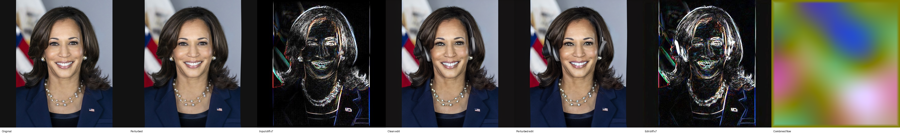

### unet.conv_in / add black sunglasses / barack_obama_01

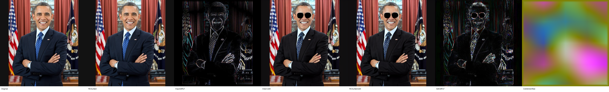

### unet.conv_in / add black sunglasses / joe_biden_01

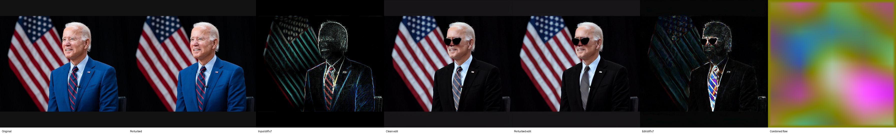

### unet.conv_in / add black sunglasses / michelle_obama_01

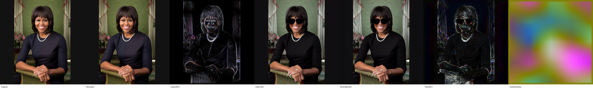

### unet.conv_in / add headphones / barack_obama_01

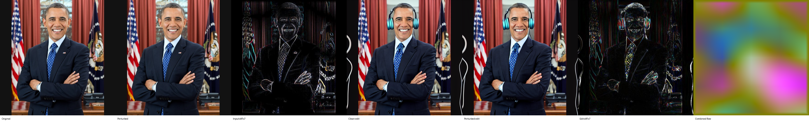

### unet.conv_in / add headphones / joe_biden_01

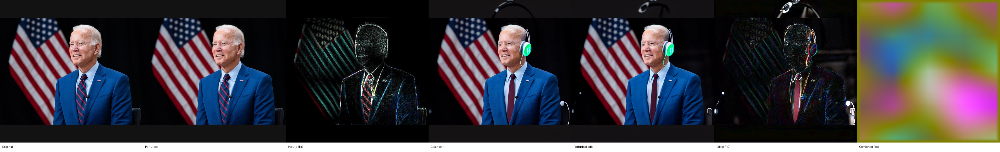

### unet.conv_in / add headphones / michelle_obama_01

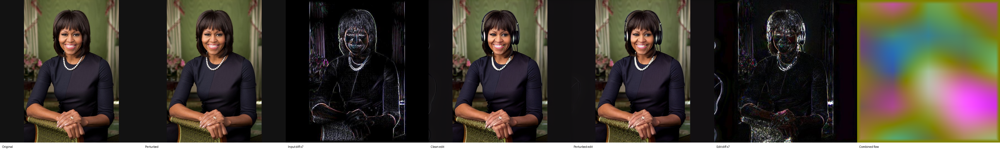

## Graphs

### Cross-run graphs

#### Z vs iteration

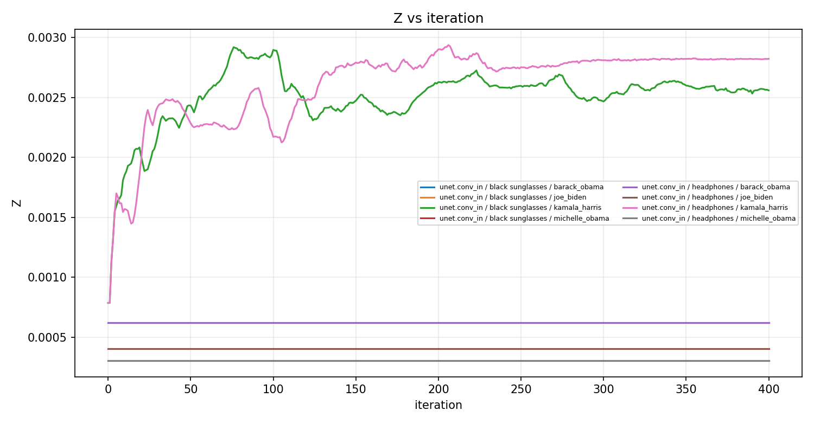

#### Loss vs iteration

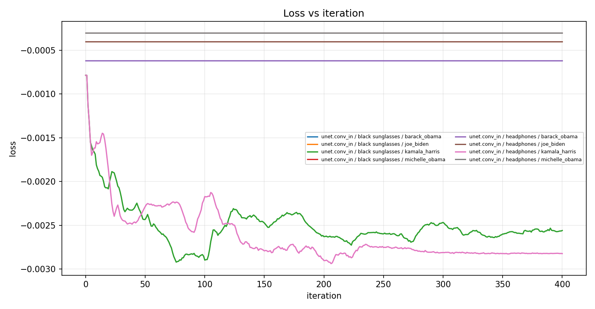

#### Input SSIM vs iteration

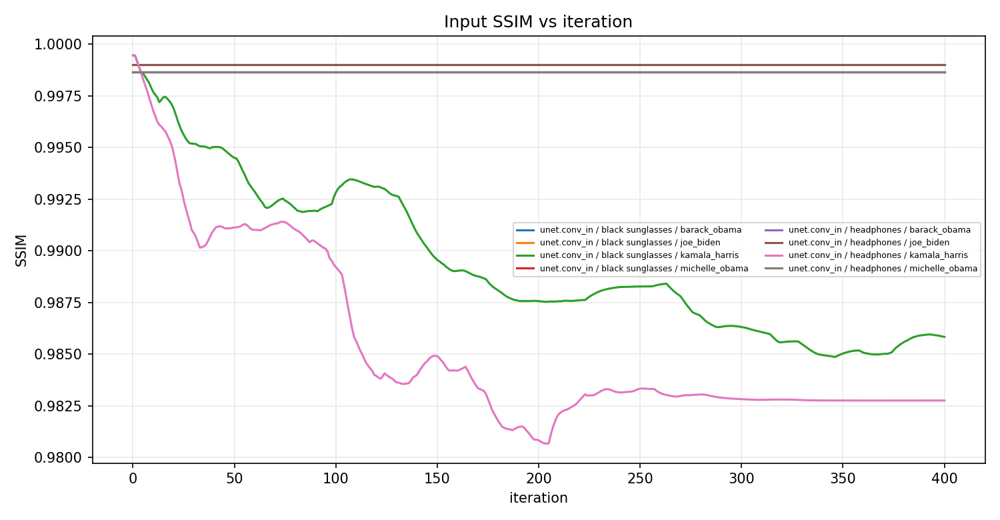

#### Input PSNR vs iteration

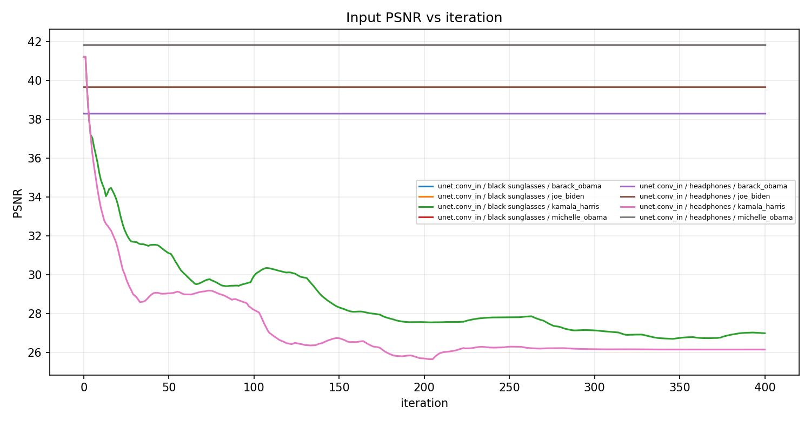

#### Combined max displacement vs iteration

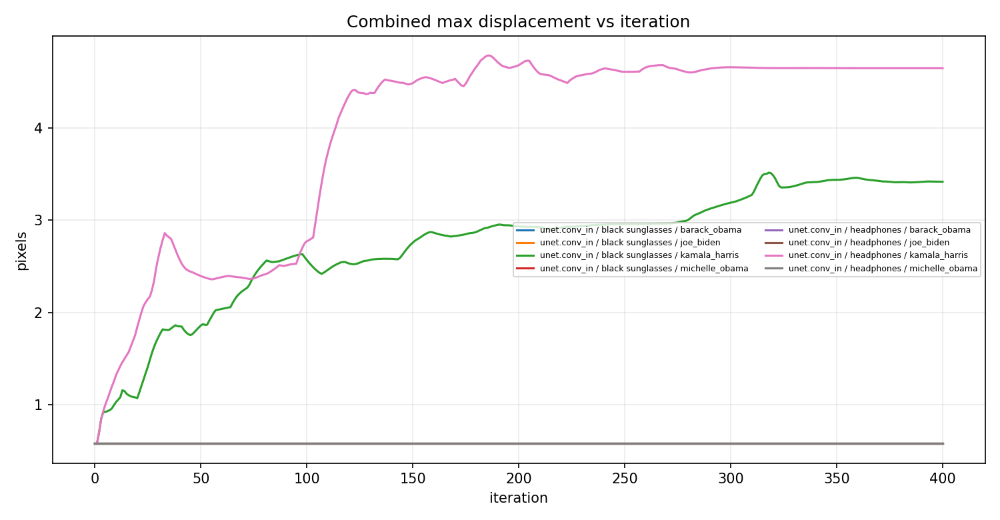

#### FFT spatial delta MSE vs iteration

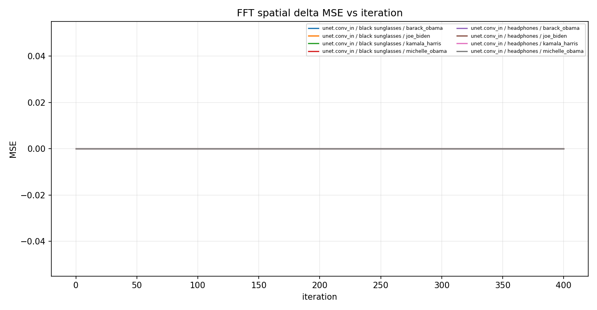

#### Component magnitude vs iteration

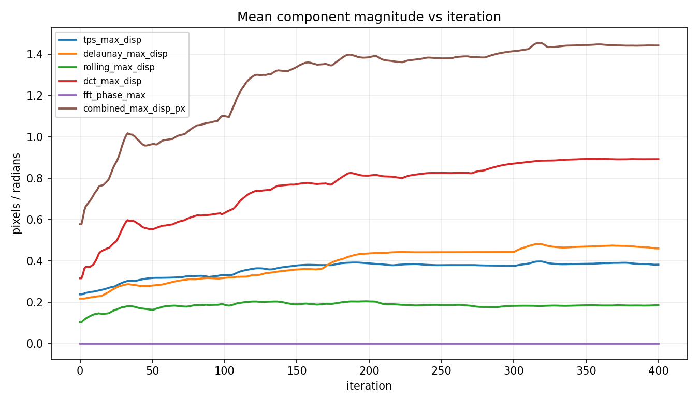

#### Z increase vs input SSIM

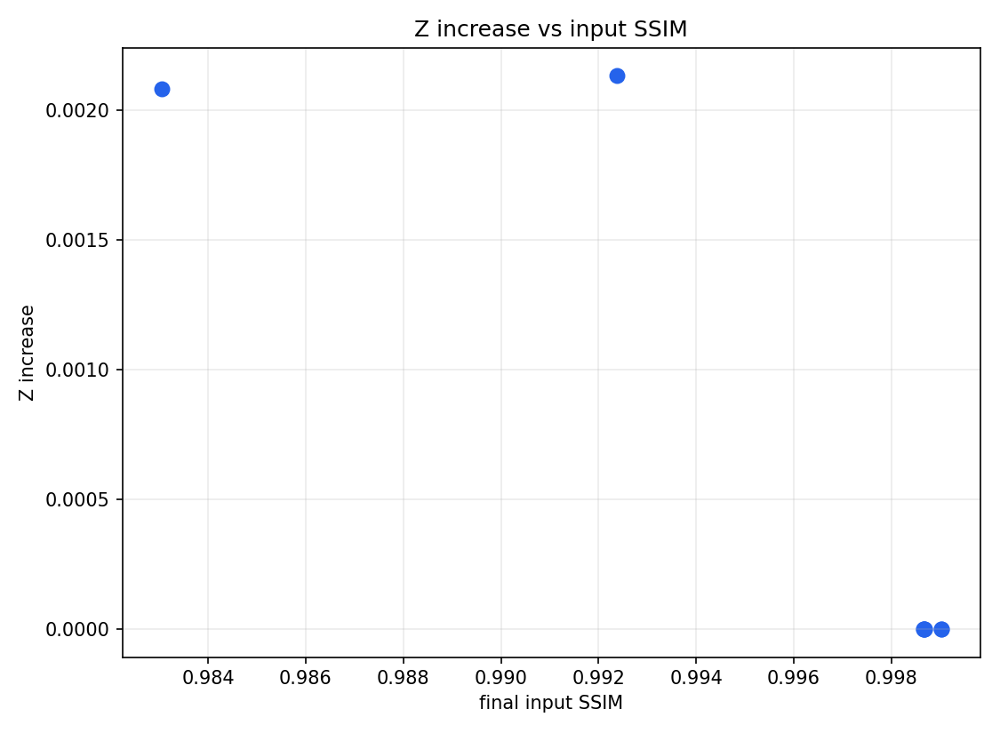
